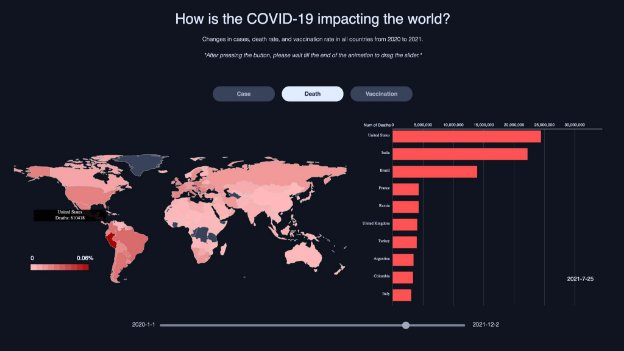
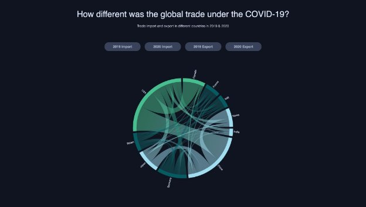
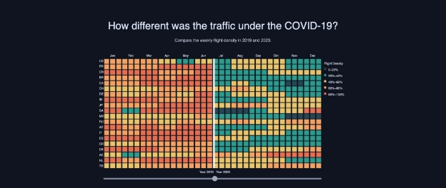

Jiayi Tang(jt656), Wenqin Ding(wd225), Bin Xu(bx83), Hongyi Wu(hw727) Project 3: Data Visualization of COVID-19

**Final Visualization**

***Introduction:***

***Visualization 1:***

***Visualization 2:***

***Visualization 3:***

**Topic and Dataset Selection**

We started our project with a research process. Each of us browsed different datasets on online data publication websites including Kaggle and Our World in Data and selected several datasets based on our interested areas. Listing the datasets together, we discussed and ideated based on the data and down-selected the most potential topic.

We decided to delve into the data about COVID-19 because of the following two reasons. First, it is important for people to learn about not only the overall trend of COVID-19 but, more importantly, its impact on our lives from different aspects. The dataset we found initially provided some interesting information about vaccinations and COVID-19’s impact on flight and trade, which can help people generate deeper insights around COVID-19. Second, the complexity and the large quantity of COVID-19 data make it potential for compelling visualizations and interesting interactions.

In the end, we decided to design and develop visualizations for COVID-19. Intending to provide the public about the COVID-19 with deeper insights, we selected these datasets: [https://covid.ourworldindata.org/data/owid-covid-data.csv (Visua](https://covid.ourworldindata.org/data/owid-covid-data.csv)lization 1) [https://comtrade.un.org/data (Vi](https://comtrade.un.org/data)sualization 2) [https://zenodo.org/record/5644749#.YarcbNDMKUk, ](https://zenodo.org/record/5644749#.YarcbNDMKUk)[https://datahub.io/core/airport-codes#resource-airport-codes (Visua](https://datahub.io/core/airport-codes#resource-airport-codes)lization 3)

**Data Description**

With the datasets, we went through an essential process of brainstorming ideas and drafted our initial ideas. We imagined the visualizations to have three parts. The first one will show the overall trend of COVID-19 in aspects of cases, death, and vaccination globally.

***Visualization 1:***

We got the original dataset (htt[ps://covid.ourworldindata.org/data/owid-covid-data.csv) for ](https://covid.ourworldindata.org/data/owid-covid-data.csv)visualization 1 from Ourdata. The dataset records daily outbreaks for all countries from January 1, 2020, to December 2, 2021. As the data provided are too large in dimension, we needed to filter and process the dataset first. The data we kept after filtration includes location, date, total\_cases, total\_cases\_per\_million ,total\_deaths, total\_deaths\_per\_million, people\_vaccinated\_per\_hundred, people\_fully\_vaccinated\_per\_hundred. We filtered out the distracting value such as the total confirmed cases of COVID-19, total confirmed cases of COVID-19 per 1,000,000 people, and total deaths attributed to COVID-19, etc.

It is worth mentioning that there are some regions in the location that is not part of the country, such as Asia, Europe, and developed countries. In terms of data processing, we divided the CSV file into nested dictionaries in JavaScript. Data is stored in the dictionary. In the dictionary, the key is the number of days from 0-702, which refers to the time from January 1, 2020,  to December 2021. In the dictionary, the key corresponds to the value of all countries and the value refers to the information of all countries for that day.

***Visualization 2:***

The second visualization visualizes the global trade under COVID-19. From the original United Nations database (htt[ps://comtrade.un.org/data), we o](https://comtrade.un.org/data)btained the trade volume between each country. Due to the downloading restrictions of the website, we could only get the trade value between 10 countries each time. To better demonstrate economic changes, we selected the 10 countries with the highest GDP in the world and downloaded 4 data files separately.

We then went through several steps to clean and reformat the dataset. First, we used Python Pandas to merge all files into one table. We then separated the four dimensions of import, export, 2019, and 2020. In this way, we can get random combinations of (2019, 2020) and (import, export). Secondly, we used Python Pandas to assign each country an index from (1-10) and fixed them to the table. Each country is composed of three-digit codes, from which we generated a CSV file composed of the source country, source country index, target country, target country index, and trade volume. Permutations and combinations of these different dimensions can generate 4 files.

***Visualization 3:***

The third graph investigates COVID-19’s impact on flight. From the dataset ( [https://zenodo.org/record/5644749#.YarcbNDMKUk), w](https://zenodo.org/record/5644749#.YarcbNDMKUk)e got the takeoff and landing status of every aircraft including the helicopter globally from January 1, 2019, to October 2021. The initial CSV files are classified by month, and there are a total of 34 CSV files with a size of 13.8GB. For each aircraft’s take-off and landing, the file includes information such as flight number if it exists, take-off time, take-off airport code, landing airport code, longitude, and latitude. The file also contains data for non-commercial airlines such as helicopters and private jets. Considering it would be more meaningful to show only the flight status of commercial airlines, we decided to filter the data. Because the data only includes four-digit airport codes, we obtained the four-digit code of each airport, the name of the airport, and the country’s code from another source ([https://datahub.io/core/airport-codes#resource-airport-codes). The li](https://datahub.io/core/airport-codes#resource-airport-codes)st includes 69,101 airports in the world and is classified by size.

We then used Python Pandas to clean up this airport file. We selected 20 countries with the most flights in the world and only kept the airports that are labeled "big airport" and their four-digit airport code. After this process, we got a total of 249 international airports, including 66 airports in the United States, 8 airports in France, 35 airports in China, 8 airports in the UK, 8 airports in Canada, etc. Next, we used Python Pandas to merge and filter the document with each flight. We only counted the departure airport of each plane. If a flight departs from one of the 249 listed airports, then we add one count to such an airport. We then add up all the flights in the country according to the country name, sort by month, and get the number of flights in each country each month.

**Visual and Interactive Design Rationale**

After the initial reformatting and editing of the datasets, we proceeded to the visualization design stage. We brainstormed different possible visualization forms for each part mentioned above in a design tool called Figma. After several iterations, we finalized our visualization designs and made a design prototype to facilitate the coding process.

***Visualization 1:***

- **Form, Variables:**

The first visualization consists of two parts. We chose the global map visualization as the main element of the first part because the datasets provided a country variable that allowed us to build the map. The other three variables of the map are case number, death number, and vaccination rate. Next to the map, a bar chart shows more detailed information corresponding to the map. The variables for the bar charts are case number, death number, and the partly and fully vaccination rate.

It shows three major aspects: case, death rate, and vaccination rate. We added a filter with three tabs (“case”, “death”, and “vaccination”) to arrange the three aspects. Under the “case” tab, the map visualizes the number of cases in different countries and the bar chart shows the number of cases in the highest 10 countries after being sorted. Under the “death”tab, the map shows the number of deaths per 1 million people in different countries, and the bar chart shows the number of deaths in the top 10 countries after being sorted. Under the “vaccination” tab, the map visualizes the vaccination percentage around the world and the bar chart shows the share of people being vaccinated among the highest 10 countries worldwide.

Another essential element of the visualization is the slider. Containing the variable of time, the slider allows viewers to investigate the data in the three filters in a specific month in the time frame from January 2020 to December 2021.

- **Marks (Shape), Channels, Legend, Color:**

The visualization format is the same for the three filters. The marks of the map can be identified as outlines and the area of each country. The visual channel is the position, size, and color hue of the marks. Each area’s color is determined by the sequential color scheme corresponding to the filter category. The color scheme appears differently under different filters (“case”, “death”, and “vaccination”). The color of the areas on the map varies from light to dark based on the data it visualizes. We designed three different color schemes for the three filters (shown in the picture below). We intentionally chose the colors so that they can well represent the data’s identity and reduce the confusion for viewers. For example, we chose the color scheme of red to express the death rate considering people usually associate “red” with death.

The marks of the bar chart are rectangles and the channels are the color hue of the rectangles and their varying vertical positions and lengths on the graph. We intended to make the color hue of the bars align with the color theme of the map so that viewers can make a connection between the two parts under each filter category. We also added light-grey gridlines to the x-axis so that it is easier for the viewers to identify the data that corresponds to the bars.

- **Interactive Elements and Design Rationale**

We added the three filters (“case”, “death”, and “vaccination”) on the top area of the visualization. The color of the button is designed to change when viewers click on it to inform the viewers about their active or inactive status. Clicking on the buttons, viewers can see filtered data visualized on the map below. We decided to add the filter buttons due to the complexity of the data we want to show. As the data shows the aspect of the case, death, and vaccination, it is impossible to show all the data at the same time. Showing them on a single page would also make the visualization look unorganized and messy. With such a filter, viewers can give full attention to an aspect at each time and have more control over their browsing experience.

An animated barchart is automatically playing each time pushing the button. Barcharts with the corresponding cases, deaths and vaccination rates are demoed in a live style covering the most recent 100 days. It shows the changing of rankings based on different standards, and it shows the trend of pandemic spreading and the control of each country.

Another interaction we added to the map is the hover-over section appearing after the viewer’s mouse stays on the area of a country. The hover-over section shows the country name and the case number, death number, or vaccination rate of the country. We reduced the transparency of the section so that it will not block the country it points to and not interfere with the viewer’s interaction with other countries. To give more feedback to the viewer when he or she hovers over a country, the country’s border becomes thicker and whiter. To help the viewers interpret the colors, we added a legend at the bottom of the map.

The slider is designed to enable the viewer to control the time frame. By sliding the button on the slider, the viewer can see the continuous changes on the map and bar chart over time and compare the data between different months.

- **From Data to Design (Data Transformations):**

We used scaleLog for the colors in the “case” map because the map is colored by the case numbers. Due to the huge differences of cases among countries, countries with larger populations tend to have more cases, it is more suitable to apply ScaleLog for displaying to differentiate. Differently, we used scaleLinear for the colors in the “death”and “vaccination” map since these two maps are colored by the density of the death and vaccination rate.

- **Tradeoff:**

One tradeoff of the visualization is the bar chart only shows several countries’data use to the incompleteness of the dataset. Viewers might wonder why we selected these countries to show. Second, the effect on the country after hovering over is not prominent. It might be hard for the viewers to notice the change.

***Visualization 2:***

- **Form, Variables:**

We chose to employ a chord diagram to visualize the trade import and export in different countries under COVID-19 in 2019 and 2020. The circle shape and the numerous chords in the chord diagram make it effective to show mutual relationships between countries. The variables of the diagram are the number of imports and exports, the countries in which the imports and exports are implemented, and the years they happened.

- **Marks (Shape), Channels, Legend, Color:**

The marks of the visualization can be identified as chords and the color hue and thickness of the chords are used as visual channels to control the appearance of each chord. The color hue of the chords helps viewers to separate different countries and continents. Countries belonging to the same continents are designed to have chords of the same color. In this way, viewers can explore not only the trade pattern through countries but also the trend between continents in a larger scope. We reduced the transparency of the chords to 20% to make every chord visible to viewers. The thickness of the chord reveals the number of imports and exports from the countries. Through the four buttons (“2019 import”, “2019 export”, “2020 import”, “2020 export”) on the top area of the visualization, viewers can filter the data by year.

- **Interactive Elements and Design Rationale**

When hovering over a country, the diagram will only show the chords that are related to the country and other unrelated chords will fade out. In this way, the viewer can explore the visualization with emphasis. In addition, it enables the viewer to compare the data among different countries.

- **From Data to Design (Data Transformations):**

Adding to what mentioned in the Dataset Description above, to successfully realize the design idea, we grouped the countries based on the continents where they belong to so that the countries from the same continent can be displayed in the same color. Finally, after recombining the document, we successfully generated four JSON files for drawing this visualization.

- **Tradeoff:**

In terms of the visual design, one tradeoff of the visualization is it is hard to tell the direction of the import and export from the two countries through the chords. As each chord is connecting two countries, viewers can only identify the overall trade amount that happened in the two countries. Second, it is difficult for viewers to see the very thin chord when the number of imports or exports is extremely small. Last but not least, the positions

of the countries on the chord are not arranged by the continents they belong to. It would be better for countries in the same continent positioned next to each other to allow the viewers to investigate the relationship between different continents. Speaking of the interactive elements, one drawback is that the viewer might not know he or she can hover over the chord to filter the data as there is no instructional information.

***Visualization 3:***

- **Form, Variables:**

We chose to use a “square chart”to visualize the weekly flight density in the corresponding weeks of 2019 and 2020. The variables that are used to construct the graph are the weekly average congestion level in 2019 and 2020, the countries, and the months.

- **Marks (Shape), Channels, Legend, Color:**

The marks of the graph can be identified by the squares on the graph. Each square represents a week starting from Monday and ending on Sunday. The visual channel employed is the color hue of the squares. In order to better show the visual changes, we divided the density level into five levels according to the value from the minimum to the maximum. The redder the color, the greater the flow of aircraft. Conversely, the bluer the color, the smaller the aircraft traffic. At the upper right of the graph, we added a legend to explain the meaning of each color hue. To allow the viewer to compare the data between 2019 and 2020, we added a line on the graph. The data for 2019 is shown on the left side of the line and the data for 2020 is shown on the right side.

- **Interactive Elements and Design Rationale**

Viewers can control the dividing line with the slider on the bottom of the graph. The slider is designed for viewers to compare the congestion level in the same week or month by moving the slider left and right. Instead of showing the information statically, the interaction gives users more control over the data and makes the visualization neater. As a result, it is more effective for the viewers to interpret the information.

- **From Data to Design (Data Transformations):**

Continuing from what was mentioned in the Data Description above, we discovered that it is unfair to map the 20 countries directly according to the number of flights. For example, in January 2019, 326,307 flights took off from major airports in the United States, while 22,251 flights took off from Turkey. To highlight the changes in traffic volume from January 2019 to December 2020, we have selected the maximum number of flights in each country during 24 months as the benchmark number "1". For all other months, change the ratio of the current month's flow to the maximum flow. For example, the US has maximum monthly traffic of 546,502 flights in 24 months, so the value in January 2019 is 326307/546502=0.597.

- **Tradeoff:**

One tradeoff of the visualization is the changes on the graph happen delayed when the viewer is moving the button on the slider. The experience could be smoother. In addition, the abbreviation of the country names on the axis might be unfamiliar to the viewer and thus will cause confusion.

**The Story**

The target viewer of our visualization is the general public as everyone on the earth is affected by the pandemic. The visualization encourages people to dig deeper into the impact on the earth brought by COVID-19. The visualization gives people an overview of the trend of COVID-19 vases, death rate, and vaccination rate among different countries and provides people an opportunity to investigate the impact of COVID-19 through trade and flight at a global scale.

Visualization 1 encourages the viewer to ponder over the changes in cases, death, and vaccination rate over time from 2020 to 2021. Through the visualization, the viewer can determine which country has the highest number of cases, death and vaccination rate and compare the number between different countries. We also encourage them to think about how vaccinations affect the number of cases and death rate. Viewers might notice that the impacts the vaccinations have on the COVID-19 are different in different countries. They can have a chance to evaluate whether vaccination has mitigation effects on the pandemic and think about any other possible causes of the trend.

Following the overview of the COVID-19 trend, visualization 2 & 3 shows more detailed information in the aspects of trade and flight. We want people to realize that COVID-19 is not only a threat to our lives but also affects all aspects of our lives. Possible ways to interpret visualization 2 include looking at the changes in the share of the world trade every country has and comparing the value between different countries or the import and export value of each country. The viewer can possibly observe from visualization 3 that, overall, the flight density in countries decreases drastically because of the pandemic.

In conclusion, through the whole visualization, we encourage viewers to think about how is COVID-19 impacting the world and try to find the connection between the trends.

**Team Contributions**

- All
  - Topic and dataset research
  - Visualization brainstorming
- Jiayi
  - Major design contribution（Color palette, Visualization elements, and prototyping visualizations)
  - Write final report (Major contributions)
- Wenqin
  - Major design contribution (Visualization elements)
  - Fix and format code based on the design prototype
  - Minor report contributions
- Bin
  - Data cleaning for Visualization 2&3
  - Visualization 1 barchart and Visualization 2&3 coding
  - Minor design & report contributions
- Hongyi
  - Data cleaning for Visualization 1
  - Visualization 1 map coding & barchart debugging
  - Minor design & report contributions

**Approximate Hourly Breakdown**

- Topic research  (2 hours)
- Topic downselection (1 hour)
- Dataset selection (2 hours)
- Visualization brainstorming and plotting the story (2 hours)
- Data cleaning  (13 hours, V1: 4h; V2: 4h; V3: 5h)
- Design prototype in Figma (3 hours)
- Revision on design (3 hours)
- Coding and plotting the graphs (16 hours for V1: 10h for the map and 6h for the animated barchart; 3 hours for V2; 4 hours for V3)
- Code debugging (10 hours)
- Writing the final report   (6 hours)
- Final check of the project  (2 hours)

**Most Time Spent:** coding and plotting
